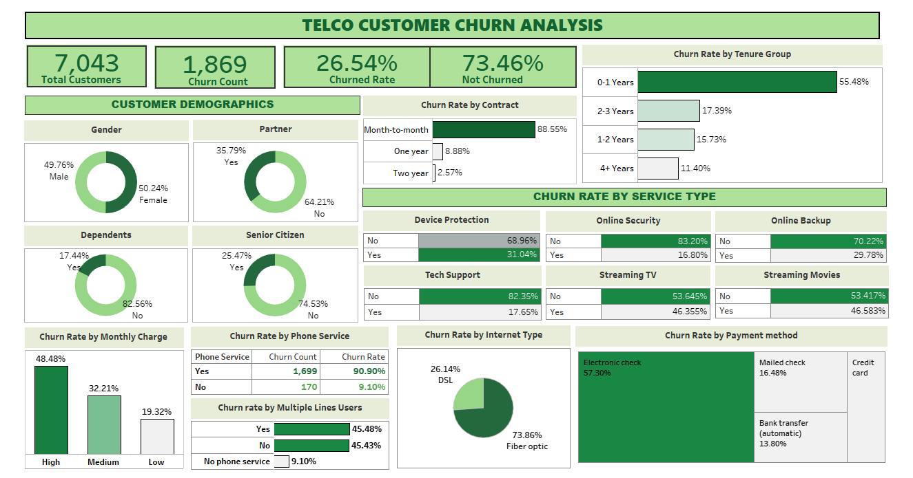

# Telco Customer Churn Analysis

## 🎯 Objective
This project focuses on customer churn analysis in the telecom industry, with the goal of understanding why customers churn and providing actionable insights to help reduce customer attrition.

---

## 🛠 Tools Used
- MySQL
- Tableau

---

## 📂 Dataset
The dataset was sourced from Kaggle and contains **7,043 rows** and **21 columns**.
It includes customer demographics, service subscriptions, contract details, monthly charges, and churn status.

---

## 🔄 Project Workflow

### MySQL
- Imported the dataset into MySQL
- Cleaned the data by handling null values and correcting data types
- Transformed the data for analysis
- Conducted exploratory data analysis (EDA)
- Analyzed churn patterns and trends
- Derived actionable insights to reduce churn

### Tableau
- Imported the cleaned dataset into Tableau
- Built a churn analysis dashboard
- Visualized key metrics such as:
  - Overall churn rate
  - Churn by tenure
  - Churn by contract type
  - Customer satisfaction across service types

---

## 📊 Dashboard Preview

---

## 🔍 Key Insights
- Customers with month-to-month contracts show the highest churn rate
- New customers with lower tenure are more likely to churn
- Long-term contracts significantly reduce churn
- Customers using fewer services are more prone to churn

---

## ✅ Conclusion
This analysis highlights key factors contributing to customer churn in the telecom industry and provides insights that can help businesses improve customer retention strategies.

